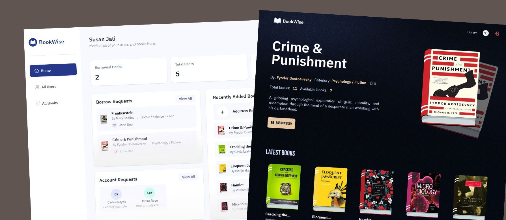

# 📚 Bookwise – University Library Management System



Bookwise is a modern full-stack University Library Management System built using **Next.js**, **PostgreSQL** and **TypeScript**. It provides students and admins with an efficient way to manage books, borrowing, profiles, and automated emails and reminders through a clean and intuitive interface.

## 🚀 Features

### 🔍 Library Catalog

- Browse books with search and pagination
- Detailed book pages with availability, summaries, videos, and similar book suggestions

### 👤 User Profiles

- Dashboard with borrowed books and account information

### 🔐 Authentication & Authorization

- Secure login using **NextAuth**
- **Role-based access** (Student vs Admin)
- Protected routes and API endpoints

### 📖 Borrowing System

- Borrow and return workflows
- Automated due date tracking
- Availability and eligibility checks
- Overdue detection and status updates

### 📬 Automated Emails

- Welcome/onboarding emails on signup
- Inactivity follow-up emails
- Due date reminders: before, on, and after due date

### 🛡️ Security & Performance

- **Upstash** for rate-limiting and DDoS protection
- **ImageKit** for optimized image/video storage and delivery
- Fast and scalable **Neon Postgres** database with Drizzle ORM

### 📊 Admin Dashboard

- Account approvals
- Books CRUD
- Borrow request management
- Analytics (book stats, users, borrow trends, etc.)

## 🛠️ Tech Stack

- Next.js
- PostgreSQL
- Drizzle ORM
- Upstash
- ImageKit
- TypeScript
- SendGrid
- Tailwind CSS

## ⚙️ Setup & Installation

### Clone the repository

```bash
git clone https://github.com/jatisusan/bookwise.git
cd bookwise
```

### Install dependencies

```bash
npm install
```

### Setup environment variables

Create a new file named .env.local in the root of your project and add:

```bash
NEXT_PUBLIC_IMAGEKIT_URL_ENDPOINT=
NEXT_PUBLIC_IMAGEKIT_PUBLIC_KEY=
IMAGEKIT_PRIVATE_KEY=

NEXT_PUBLIC_API_ENDPOINT=
NEXT_PUBLIC_PROD_API_ENDPOINT=

DATABASE_URL=
AUTH_SECRET=

UPSTASH_REDIS_REST_URL=
UPSTASH_REDIS_REST_TOKEN=

QSTASH_URL=
QSTASH_TOKEN=

SENDGRID_API_KEY=
SENDGRID_FROM_EMAIL=
```

Replace the placeholder values with your actual ImageKit, NeonDB, Upstash, and SendGrid credentials.

### Run the project

```bash
npm run dev
```

Open http://localhost:3000 in your browser to view the project.
